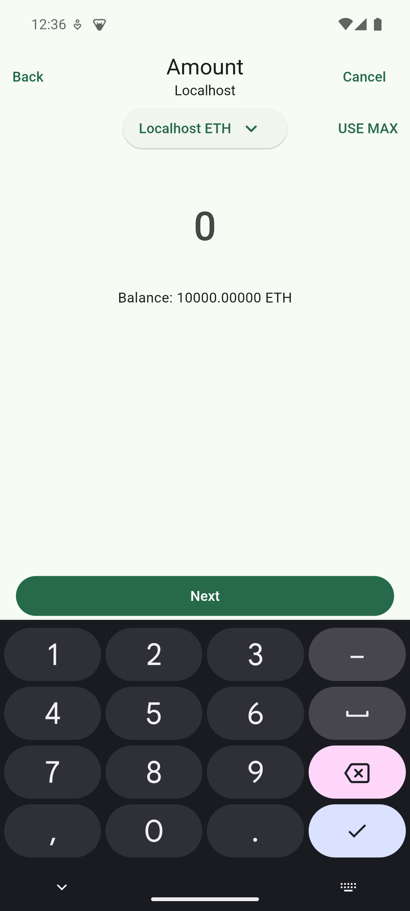

<!-- Improved compatibility of back to top link: See: https://github.com/othneildrew/Best-README-Template/pull/73 -->

<!--
*** Thanks for checking out the Best-README-Template. If you have a suggestion
*** that would make this better, please fork the repo and create a pull request
*** or simply open an issue with the tag "enhancement".
*** Don't forget to give the project a star!
*** Thanks again! Now go create something AMAZING! :D
-->

<!-- PROJECT SHIELDS -->
<!--
*** I'm using markdown "reference style" links for readability.
*** Reference links are enclosed in brackets [ ] instead of parentheses ( ).
*** See the bottom of this document for the declaration of the reference variables
*** for contributors-url, forks-url, etc. This is an optional, concise syntax you may use.
*** https://www.markdownguide.org/basic-syntax/#reference-style-links
-->

<!-- PROJECT LOGO -->
 

  

  <h3 align="center">Kriptum</h3>

  

    Ethereum wallet client app built with Flutter
   
   
    
  

<!-- TABLE OF CONTENTS -->

<!-- 

Table of Contents

  <ol>
    <li>
      <a href="#about-the-project">About The Project</a>
    </li>
    <li>
      <a href="#built-with">Built With</a>
    </li>
    <li>
      <a href="#getting-started-npm-package">Getting Started (NPM Package)</a>
    </li>
    <li>
      <a href="#getting-started-source-code">Getting Started (Source Code)</a>
    </li>
    <li>
      <a href="#getting-started-docker">Getting Started (Docker)</a>
    </li>
    <li>
      <a href="#license">License</a>
    </li>
  </ol>

 -->

<!-- ABOUT THE PROJECT -->

## About The Project

This application is heavily inspired on Metamask for learning purposes. You can check its features [here](docs/features.md).

<!-- 

    

 -->

### Built With

<!-- * [![JQuery][JQuery.com]][JQuery-url]-->

- [Flutter](https://flutter.dev/)
- [Dart](https://dart.dev/)
- [web3dart](https://pub.dev/packages/web3dart)

## Screenshots

  
  
  

  
  
  

  
  
  

## License

Distributed under the MIT License. See `LICENSE` for more information.

<!--

(<a href="#readme-top">back to top</a>)

-->